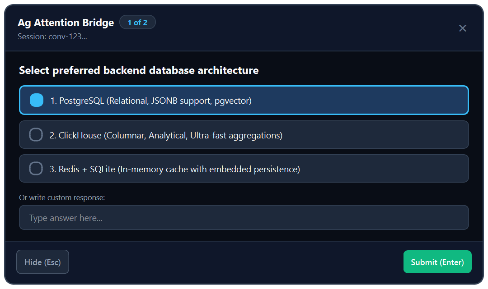
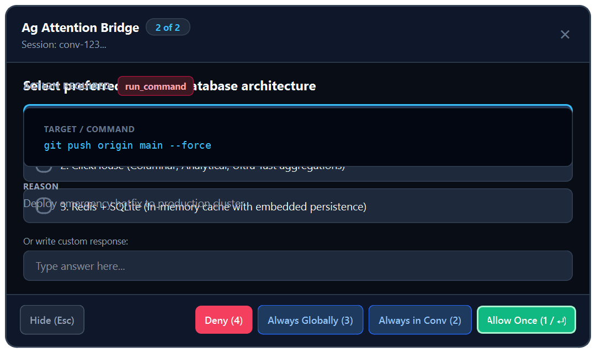

# Ag Attention Bridge

A lightweight desktop companion for **Google Antigravity** on Linux (**KDE Plasma + Wayland / X11**) and **Windows** (Win32).

Surfaces `ask_question`, permissions, and approvals as an always-on-top modal dialog and persistent system tray icon, letting you respond to the AI assistant in milliseconds without switching away from your active workflow.

---

## Visual Preview & Interface Showcase

| Question Interaction Dialog | Permission & Command Approval Dialog |
|:---:|:---:|
|  |  |
| *Direct `1-9` numeric quick-select, arrow keys, and freeform response* | *Monospace command target preview, justification reason, and `1-4` instant approvals* |

---

## 1. Overview & Key Capabilities

* **Universal Multi-Project Discovery**: Automatically monitors active Antigravity Language Servers across all workspace folders and projects on your system via active background polling (`needsAttention: true`). Global installation covers everything without per-project setup.
* **Always-On-Top Modal**: Compact, content-driven dark modal with project title badge (`📁 <project_name>`), session ID, model tag, and queue indicators.
* **Keyboard-First Navigation**:
  * **Question Dialogs**: `1–9` directly selects visible options; `↑` / `↓` / `Tab` navigates; `Enter` submits.
  * **Permission Dialogs**:
    * `1` or `Enter`: **Allow this time** (`PERMISSION_SCOPE_ONCE`)
    * `2`: **Always allow in this conversation** (`PERMISSION_SCOPE_CONVERSATION`)
    * `3`: **Always allow globally** (`PERMISSION_SCOPE_GLOBAL`)
    * `4` or `D`: **Deny**
    * `←` / `→` / `Tab`: Navigate between all permission action buttons.
  * `Esc`: Hide to system tray (**does not deny or cancel the interaction**; remains pending and accessible from tray).
* **Persistent System Tray**: Dynamic numeric badge rendered into the tray icon via `QPainter`. Left-click to reopen pending requests; right-click context menu for quick controls.
* **Multi-Session FIFO Queue**: Seamlessly queues interactions across multiple concurrent agent conversations.
* **Customizable Appearance & Themes**: Built-in dark and light theme presets (`Midnight`, `OLED Pure Black`, `Nord`, and `Light`), custom accent colors (Sky Blue, Emerald, Amber, Violet, Rose), adjustable dialog width (560px–960px), and HiDPI font scaling. Accessible directly via the modal header (`⚙`) or the system tray menu (`Appearance & Settings...`).
* **Ultra-Low Resource Footprint**: Pure event-driven Qt event loop with ~0% idle CPU and ~70–90MB RAM.

---

## 2. Technical Specifications

| Specification | Detail |
|---|---|
| **Language & Runtime** | Python 3.11+ (Tested on Python 3.11, 3.12, 3.14) |
| **GUI Framework** | PySide6 / Qt6 Widgets (`QApplication`, `QDialog`, `QSystemTrayIcon`) |
| **Local IPC** | `QLocalServer` & `QLocalSocket` (Unix Domain Socket at `$XDG_RUNTIME_DIR/ag-attention-bridge.sock`) |
| **Antigravity Transport** | Loopback HTTPS ConnectRPC (`127.0.0.1:<dynamic_port>`) with dynamic CSRF authentication |
| **Primary Platform** | Linux with KDE Plasma (Wayland / X11) |
| **Antigravity Compatibility** | Antigravity IDE `1.1.3+` (Extension `0.2.0+`, commit `ecfbad74d939`) |
| **Process Model** | Single background daemon per user session; lightweight CLI adapter for hook execution (<15ms) |

---

## 3. Installation & Setup

### 3.1 Prerequisites
Ensure Python 3.11+ and standard Qt6 build libraries are available on your system:

```bash
# Debian / Ubuntu
sudo apt install python3 python3-venv libgl1 libegl1 libxkbcommon0

# Arch Linux / Manjaro
sudo pacman -S python libglvnd libxkbcommon

# Fedora
sudo dnf install python3 libglvnd-glx libxkbcommon
```

### 3.2 Setup Repository & Virtual Environment
```bash
# Clone the repository
git clone https://github.com/ekyaaa/ag-attention-bridge.git
cd ag-attention-bridge

# Create virtual environment and install dependencies
python3 -m venv .venv
.venv/bin/pip install --upgrade pip
.venv/bin/pip install -e .
```

### 3.3 One-Command Global Installation
Run the automated installation script:

```bash
bash scripts/install-hooks.sh
```

This script will:
1. Symlink `ag-hook-adapter` and `ag-attention-bridge` into `~/.local/bin/`.
2. Automatically configure global Antigravity hooks in `~/.gemini/config/hooks.json`.
3. Start the `ag-attention-bridge` daemon in the background with the system tray icon active.

### 3.4 Recommended KDE KWin Window Rule (Wayland)
For optimal focus and keep-above behavior under KDE Wayland, configure a KWin Rule:
1. Open **System Settings** → **Window Management** → **Window Rules** → **Add New...**
2. Configure:
   * **Description**: `Ag Attention Bridge Keep Above`
   * **Window class (application)**: Exact Match `ag-attention-bridge`
   * **Keep above**: Force → `Yes`
   * **Initial placement**: Force → `Centered`
   * **Focus stealing prevention**: Force → `None`
   * **Skip taskbar / pager**: `Yes`

### 3.5 Uninstallation
To completely remove hooks and stop the daemon:
```bash
bash scripts/uninstall-hooks.sh
```

---

## 4. Expanding to Other Environments (GNOME, Windows, macOS, etc.)

The core architecture of Ag Attention Bridge is modular and decoupled:

```text
Antigravity Hooks ──► Hook Adapter ──► Local IPC ──► Daemon / Domain ──► UI Modal
```

All hook handling, protocol serialization, ConnectRPC client code, queue management, and domain models are **platform-independent**. To support other desktop environments or operating systems, refer to the guidance below.

---

### 4.1 GNOME Desktop (Wayland / X11)

| Area | Current (KDE) | Adaptation Required for GNOME |
|---|---|---|
| **System Tray** | KDE Plasma StatusNotifierItem (SNI) | GNOME Shell removed native system tray icons. Users **must** install the [AppIndicator and KStatusNotifierItem Support](https://extensions.gnome.org/extension/615/appindicator-support/) GNOME extension (`gnome-shell-extension-appindicator`). |
| **Keep-Above Window** | KWin Window Rule | GNOME Wayland (Mutter) does not support KWin rules. `Qt.WindowStaysOnTopHint` provides basic keep-above. For forced focus, users can use Mutter window rules or a GNOME extension like *Always on Top*. |
| **Process Discovery** | `/proc` inspection | **No changes needed**; works out of the box on Linux GNOME. |
| **IPC Socket** | Unix Domain Socket | **No changes needed**; uses `$XDG_RUNTIME_DIR`. |

---

### 4.2 Tiling Window Managers & Other Compositors (Hyprland, Sway, i3, XFCE)

* **Hyprland**: Add floating and pinning rules to `hyprland.conf`:
  ```ini
  windowrulev2 = float, class:^(ag-attention-bridge)$
  windowrulev2 = pin, class:^(ag-attention-bridge)$
  windowrulev2 = center, class:^(ag-attention-bridge)$
  ```
* **Sway / i3**: Add floating rule to config:
  ```ini
  for_window [app_id="ag-attention-bridge"] floating enable, sticky enable, border pixel 2
  ```
* **Waybar / Polybar**: Ensure the bar includes the `tray` module; `QSystemTrayIcon` publishes automatically via DBus SNI.

---

### 4.3 Windows (Win32)

Ag Attention Bridge is **100% natively compatible on Windows** (Win32):

- **Zero-Dependency Win32 Named Pipes**: Direct communication between `ag-hook-adapter` and `QLocalServer` via standard library `ctypes`.
- **Win32 Mutex Guard**: Enforces strict single-instance daemon per user desktop session.
- **Toolhelp32 Snapshot**: Sub-5ms process lifecycle discovery without `/proc`.
- **System Tray**: Native integration into the Windows Notification Area.

#### Quickstart / Installation on Windows

To install and integrate hooks automatically into Antigravity on Windows:

```powershell
# Run from repository root (no administrator privileges needed)
powershell -ExecutionPolicy Bypass -File scripts\install.ps1
```

This will:
1. Deploy fast launcher shims to `%LOCALAPPDATA%\ag-attention-bridge\bin`.
2. Add the bin folder to your User `PATH`.
3. Safely register hooks in `%USERPROFILE%\.gemini\config\hooks.json`.
4. Create an autostart shortcut in your Windows Startup folder.
5. Launch the daemon in the background (`pythonw.exe`).

#### Daily Workflow with Antigravity CLI (`agy`)

Once `scripts\install.ps1` completes, **no additional setup is needed** in your day-to-day workflow. The bridge hooks directly into Antigravity's global lifecycle:

1. **Run Antigravity CLI as usual**:
   ```bash
   agy
   ```
2. **Instant Desktop Interruption**:
   Whenever your agent asks a multiple-choice question (`ask_question`) or requests execution permission (`ask_permission`), the dialog window automatically appears in focus on your screen.
3. **One-Key Responses**:
   - For questions: Type `1`, `2`, `3`... or navigate with `Tab` / `↑` / `↓` and press `Enter`.
   - For permissions: Press `1` or `Enter` to Allow once, `2` for Conversation, `3` Globally, or `4` to Deny.
4. **Minimizing to Background (`Esc`)**:
   Pressing `Esc` or clicking `X` hides the dialog to your Windows System Tray (Taskbar Notification Area) without canceling or denying the request. A badge on the tray icon shows how many requests are waiting.
5. **Verifying Daemon Status**:
   To confirm the bridge daemon is running:
   ```powershell
   Get-Process pythonw | Where-Object { $_.CommandLine -like "*ag_attention_bridge*" }
   ```

#### Uninstallation on Windows

To completely remove hooks, shortcuts, and shims:

```powershell
powershell -ExecutionPolicy Bypass -File scripts\uninstall.ps1
```

#### Standalone Windows Installer Packaging

To build a standalone `.exe` setup wizard (Inno Setup) that requires no Python installed:

```powershell
# 1. Build standalone executable bundle with PyInstaller
pyinstaller packaging\windows\ag-attention-bridge.spec

# 2. Compile setup wizard with Inno Setup 6
iscc packaging\windows\installer.iss
```

This produces `dist\AgAttentionBridge-Setup.exe` with standard Start Menu shortcuts, uninstaller in Windows *Add or remove programs*, and automatic hooks management.

---

### 4.4 macOS (Darwin)

To port Ag Attention Bridge to macOS:

1. **Process Discovery**:
   * Search for `language_server_darwin_arm64` or `language_server_darwin_x64` using `psutil` or `sysctl`.
2. **Menu Bar / System Tray**:
   * `QSystemTrayIcon` natively renders into the macOS menu bar.
3. **Window Stays-On-Top**:
   * `Qt.WindowStaysOnTopHint` works out of the box. For strict overlay behavior over full-screen apps, use PyObjC:
     ```python
     from AppKit import NSFloatingWindowLevel

     ns_window.setLevel_(NSFloatingWindowLevel)
     ```
4. **Hooks Path**:
   * Antigravity hooks on macOS reside in `~/.gemini/config/hooks.json`.

---

## 5. Development & Testing

### Running Tests & Code Quality Checks
The project uses **Ruff** for formatting and linting, **Mypy** for static type checking, and **pytest** for automated tests:

```bash
# Run linter
ruff check src tests

# Run formatter check (or 'ruff format src tests' to format)
ruff format --check src tests

# Run static type checker
mypy src

# Run test suite with coverage
pytest --cov=ag_attention_bridge --cov-report=term-missing

# Set up pre-commit hooks
pre-commit install

# Or run all quality checks at once:
bash scripts/check.sh       # On Linux / macOS
scripts\check.bat           # On Windows
```

### Standalone CLI Interaction Test
You can test the native ConnectRPC interaction flow directly from the terminal without the modal:

```bash
.venv/bin/python3 scripts/test_native_interaction.py --workspace /path/to/workspace
```

---

## 6. Documentation & Version Maintenance

Comprehensive engineering documentation and version upgrade guides are available in the [`docs/`](./docs/) directory:

* [**`NATIVE_INTERACTION_IMPLEMENTATION.md`**](./docs/NATIVE_INTERACTION_IMPLEMENTATION.md): Deep-dive into the ConnectRPC architecture, candidate selection algorithm, step anatomy, and modal header integration.
* [**`ANTIGRAVITY_NATIVE_INTERACTION_RESEARCH.md`**](./docs/ANTIGRAVITY_NATIVE_INTERACTION_RESEARCH.md): Original reverse-engineering findings and protocol analysis of Antigravity internal runtime.
* [**`docs/version/README.md`**](./docs/version/README.md): Version compatibility matrix.
* [**`docs/version/ANTIGRAVITY_1.1.3_SPEC.md`**](./docs/version/ANTIGRAVITY_1.1.3_SPEC.md): Baseline technical specification for Antigravity 1.1.3 (binary hashes, flags, endpoints, protobuf schemas).
* [**`docs/version/UPGRADE_GUIDE.md`**](./docs/version/UPGRADE_GUIDE.md): Step-by-step diagnostic runbook, code modification mapping table, and troubleshooting tree for when Antigravity releases updates.

---

## 7. License

MIT License. Developed for use with Google Antigravity.
